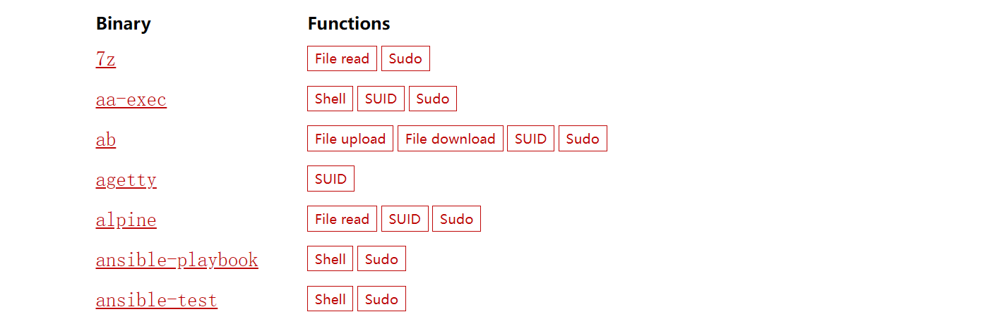

# Road_to_Sec
Too lazy to take notes, write down the study passage

---

# Their Blog

[Decoder's Blog – IT Security Tips and Tricks](https://decoder.cloud/)  如果你想学习Windows土豆家族，看它的blog就完了。土豆提权的历史中的重要人物

[itm4n's blog ](https://itm4n.github.io/)Windows安全研究员，badpotato引用的他的blog

​	

​	

# 恶意软件分析

---

[LOLBAS (lolbas-project.github.io)](https://lolbas-project.github.io/)

Windows 可执行文件一览

[GTFOBins](https://gtfobins.github.io/)

Linux 可执行文件一览

[Filesec.io](https://filesec.io/#)

实时更新攻击者可能使用的文件后缀

[Docguard | Detects suspicious files!](https://app.docguard.io/examples)

收集bypass AV的钓鱼样本，可以根据hash去分析平台下载样本

# CTF competition

---

> [CA CTF 2022: Using pentesting techniques to decrypt Chrome’s passwords - Seized (hackthebox.com)](https://www.hackthebox.com/blog/seized-ca-ctf-2022-forensics-writeup)
>
> Chrome浏览器密码解密，非本地

# SEC 

---

## Linux 相关

### 反弹shell 原理

> 先知精品，两篇文章搞定反弹shell原理
>
> [Linux反弹shell（一）文件描述符与重定向 - 先知社区 (aliyun.com)](https://xz.aliyun.com/t/2548)
>
> [Linux 反弹shell（二）反弹shell的本质 - 先知社区 (aliyun.com)](https://xz.aliyun.com/t/2549)

### HTTP参数污染

> [参数污染漏洞（HPP）挖掘技巧及实战案例全汇总](https://cloud.tencent.com/developer/article/1516333)
>
> 

# Sql-i

---

## sqlmap

### sqlmap  --os-shell原理

> [sqlmap --os-shell原理](https://xz.aliyun.com/t/7942)

# Red_Team[红队]

---

## 提权

## Linux提权

> Suid提权
>
> 可疑二进制文件查询网站，[GTFOBins](https://gtfobins.github.io/)
>
> 

## C2

C2矩阵

> [The C2 Matrix](https://www.thec2matrix.com/)

## 学习资料

> [Archive (3gstudent.github.io)](https://3gstudent.github.io/archive)  ——三好学生的博客，域渗透必看，来自公鸡1ight的倾力推荐

> [payloads tools on offsec.tools](https://offsec.tools/tag/payloads) 国外工具库

# Java反序列化

[浅析 Java 序列化和反序列化 (seebug.org)](https://paper.seebug.org/792/#_4)  ——谈的其实很深 by **gyyyy@猎户攻防实验室**

# webshell

> [中国特色PHP大马 | 素十八 (su18.org)](https://su18.org/post/su18.php/#一-前言) —— PHP 小马，大马，各种马和绕过检测原理

> s[冰蝎v4.0传输协议详解 (qq.com)](https://mp.weixin.qq.com/s/EwY8if6ed_hZ3nQBiC3o7A) —— 冰蝎作者原创，相当于冰蝎v4.0的用户手册了

# 网络基础

> [tcpdump/wireshark 抓包及分析（2019） (arthurchiao.art)](http://arthurchiao.art/blog/tcpdump-practice-zh/)
>
> 用tcpdump/wireshark 抓包详细分析了tcp三次握手、四次挥手的过程

# Blue_Team [蓝军]

---

## 应急响应实战记录

> [一次内网挖矿病毒的应急响应 - 先知社区 (aliyun.com)](https://xz.aliyun.com/t/9180)
>
> 2021年2月的文章，涉及到挖矿病毒探查，清理，简单的清理病毒的shell脚本编写

> [一次短信验证码攻击的应急响应 - 先知社区 (aliyun.com)](https://xz.aliyun.com/t/8988)
>
> 涨见识系列，先放这吧：）

> [Purp1eW0lf/Blue-Team-Notes: You didn't think I'd go and leave the blue team out, right? (github.com)](https://github.com/Purp1eW0lf/Blue-Team-Notes#powershell-tips)
>
> 外国友人出品的蓝队笔记，最近(23年)还在更新的，全英文

> [Bypass007/Emergency-Response-Notes: 应急响应实战笔记，一个安全工程师的自我修养。 (github.com)](https://github.com/Bypass007/Emergency-Response-Notes)
>
> 一个安全工程师的应急响应实战笔记，星球免费，涨见识系列

> [飞鸟 · 语雀 (yuque.com)](https://www.yuque.com/feiniao112)
>
> 安全分析专家，记载个人应急响应实战经验

# APT hunter

APT的攻击手法对RT而言很有借鉴意义，收录公开的APT追踪报告

---

> [伊朗APT组织入侵美国政府内网全过程揭秘（上篇）](https://mp.weixin.qq.com/s/J5x06rs88Z2kliCoZ9HgVA)
>
> 《*2023-01-14*》  ABC123安全研究实验室
>
> 涉及到APT事件报告的流程图，思路清晰。一次完整的红队攻击

# Stared  Github 仓库

star太多不好翻看，在这儿放点有趣的

---

## Other 

**[Other都是不太好分类的，但是绝对diao的，所有放在前面]**

> [izj007/wechat: 微信收藏的文章 (github.com)](https://github.com/izj007/wechat)
>
> 干货很多，第一时间收录保存每天更新的干货公众号文章，公众号很多好东西，只是传播难，不容易发现

> [knownsec/404StarLink: 404StarLink - 推荐优质、有意义、有趣、坚持维护的安全开源项目 (github.com)](https://github.com/knownsec/404StarLink)
>
> 知道创宇 404计划，收集优秀的安全项目

